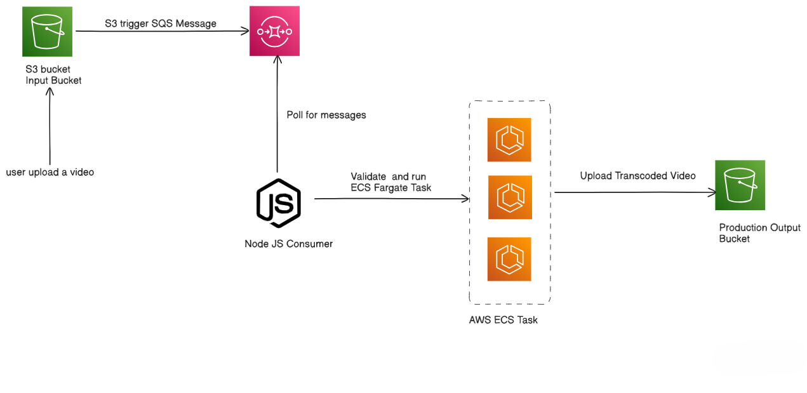

# HLS Adaptive Bitrate Streaming Pipeline

This project implements a serverless, scalable video transcoding pipeline using AWS S3, SQS, ECS Fargate, and Dockerized FFmpeg. It automatically converts uploaded videos into HLS adaptive bitrate streams.

---

## Architecture Overview

1. **User uploads video** to an S3 input bucket.
2. **S3 triggers an event** sent to an SQS queue.
3. **Node.js SQS Consumer** polls the queue, extracts the S3 key, and launches an ECS Fargate task.
4. **ECS Fargate Task** (Docker container) downloads the video, transcodes it to HLS renditions using FFmpeg, and uploads results to the output S3 bucket.

 

---


---

## Setup & Deployment

### Prerequisites

- AWS Account with S3, SQS, ECS Fargate, and IAM permissions
- Node.js 18+
- Docker (for building ffmpeg container)
- AWS CLI configured

### Environment Variables

Create a `.env` file with:
```bash
AWS_ACCESS_KEY_ID=your-access-key AWS_SECRET_ACCESS_KEY=your-secret-key ECS_CLUSTER_ARN=your-ecs-cluster-arn TASK_DEFENITION_ARN=your-task-definition-arn SQS_QUEUE_URL=your-sqs-queue-url INPUT_S3_BUCKET=your-input-bucket OUTPUT_S3_BUCKET=your-output-bucket
```